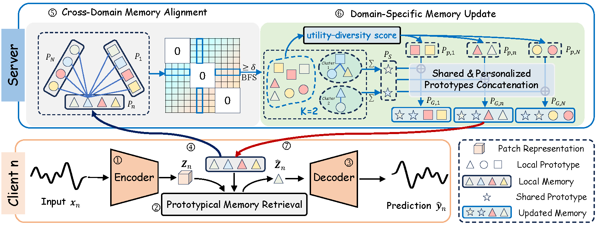

# Discrete Prototypical Memories for Federated Time Series Foundation Models

[](https://opensource.org/licenses/MIT)
[](https://www.python.org/downloads/release/python-390/)
[](https://pytorch.org/get-started/locally/)

Official PyTorch implementation for **FedUnit**, a **Fed**erated framework for learning **Uni**fied **T**ime-series representations via discrete prototypical memories.

## 🎯 Overview

<p align="center">

<br>
<em>Figure 1. The overall architecture of the proposed FedUnit framework.</em>
</p>

## 📂 Project Structure

```text
.
├── data_provider/          # Data loading and factory
├── exp/                   # Core experiment execution logic
├── layers/                # Custom neural network layers (Transformer, etc.)
├── lib/
│   ├── models/            # VQ-VAE and backbone model implementations
│   └── utils/             # Loggers, checkpoints, and metrics
├── federated_learning_main.py  # Main entry point for training
└── federated_components.py      # Federated server and client definitions
```

## 📝 Install Dependencies

First, ensure you have the required packages installed.

```bash
pip install -r requirements.txt
```


## 👉 Data Preparation

### 1. Download Datasets
Please [download here](https://drive.google.com/drive/folders/1vE0ONyqPlym2JaaAoEe0XNDR8FS_d322) and place the `.csv` files into the `Datasets` folder:

```text
Datasets/
└── imputation_and_forecasting_data/
    ├── electricity/
    │   └── electricity.csv 
    ├── weather/
    │   └── Weather.csv
    ├── exchange_rate/
    │   └── exchange_rate.csv
    └── ETT-small/
        ├── ETTh1.csv
        ├── ETTh2.csv
        ├── ETTm1.csv
        └── ETTm2.csv
```

### 2. Preprocessing
Run the following script to generate `.npy` cache Files in `saved_data/`:
```bash
bash extract_all_data.sh
```

## 🚀 Experiments

### 1.Full-Shot Federated Learning
Train the model across all clients using the default federated setting:
```bash
bash train_FL_setting.sh
```

### 2.Few-Shot Learning (5% & 10%)
We evaluate the framework's robustness using only a fraction of the local data:
*   **5% Data**: `bash few_shot_5percent.sh`
*   **10% Data**: `bash few_shot_10percent.sh`

## ⚙️ Configuration
You can customize the training by modifying:
*   `vqvae.json`: Codebook size, embedding dimension, and compression factor.
*   `Ablation_args_transformer.yaml`: Backbone Transformer hyperparameters.
*   `cuda_id`: GPU device ID in the `.sh` scripts.

## 🌟 Citation

If you find this work is helpful to your research, please consider citing:

```
Coming Soon!
```
Thanks for your interest in our work!
